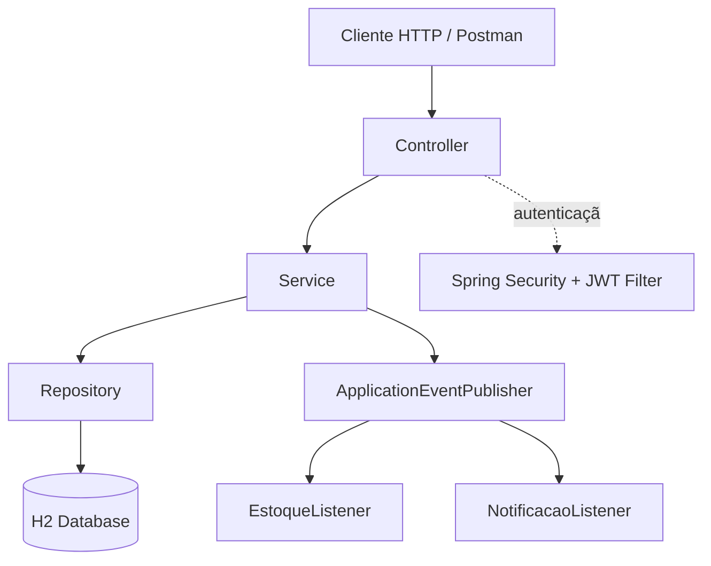

# ShopLite API


API REST de um e-commerce simplificado, desenvolvida como projeto de estudo aprofundado em **Testes (JUnit 5, Mockito, TDD)**, **JPA/Hibernate**, **Spring Security com JWT** e **Padrões de Projeto**.

## Sobre o projeto

O ShopLite simula o backend de uma loja online: produtos organizados por categoria, pedidos com múltiplos itens, cupons de desconto e controle de acesso por papel de usuário (Cliente, Vendedor, Admin).

Este projeto foi construído de forma incremental e documentada, com foco em praticar conceitos fundamentais de desenvolvimento backend profissional, não apenas em "fazer funcionar".

## Tecnologias

- Java 17
- Spring Boot 3
- Spring Data JPA (Hibernate)
- Spring Security + JWT (jjwt)
- H2 Database (banco em memória para desenvolvimento/estudo)
- JUnit 5 + Mockito
- Lombok
- Swagger / OpenAPI (springdoc-openapi)
- GitHub Actions (CI)

## Arquitetura



Camadas: `Controller → Service → Repository → Model`, com DTOs isolando o que trafega pela API do modelo de domínio interno.

## Padrões de projeto aplicados

| Padrão | Onde | Por quê |
|---|---|---|
| Repository | `*Repository` (via Spring Data JPA) | Abstrai o acesso a dados |
| Strategy | `service.desconto.EstrategiaDesconto` e implementações | Permite trocar o algoritmo de cálculo de desconto sem `if/else` |
| Factory | `DescontoStrategyFactory` | Centraliza a escolha de qual estratégia de desconto usar |
| Builder | DTOs de resposta (`@Builder` do Lombok) | Constrói objetos de resposta de forma legível |
| Observer | `PedidoConfirmadoEvent` + Listeners | Desacopla a confirmação do pedido de suas consequências (baixa de estoque, notificação) |

## Como rodar o projeto

```bash
git clone https://github.com/SEU-USUARIO/shoplite-api.git
cd shoplite-api
./mvnw spring-boot:run
```

A aplicação sobe em `http://localhost:8080`.

- Console do banco H2: `http://localhost:8080/h2-console` (JDBC URL: `jdbc:h2:mem:shoplite`)
- Documentação interativa (Swagger): `http://localhost:8080/swagger-ui.html`

## Principais endpoints

| Método | Rota | Acesso | Descrição |
|---|---|---|---|
| POST | `/auth/register` | Público | Registra um novo usuário (papel CLIENTE por padrão) |
| POST | `/auth/login` | Público | Autentica e retorna um token JWT |
| GET | `/categorias` | Público | Lista categorias |
| POST | `/categorias` | VENDEDOR, ADMIN | Cria uma categoria |
| GET | `/produtos` | Público | Lista produtos |
| POST | `/produtos` | VENDEDOR, ADMIN | Cria um produto |
| POST | `/pedidos` | CLIENTE | Cria um pedido |
| POST | `/pedidos/{id}/itens` | CLIENTE | Adiciona um item ao pedido |
| POST | `/pedidos/{id}/confirmar` | CLIENTE | Confirma o pedido, calcula desconto e dá baixa no estoque |

## Testes

```bash
./mvnw test
```

Os testes unitários cobrem as principais regras de negócio (validação de estoque, cálculo de desconto), utilizando JUnit 5 e Mockito para isolar as dependências, seguindo o ciclo TDD (Red-Green-Refactor).

## Limitações conhecidas (projeto de estudo)

- O endpoint `/auth/register` sempre cria usuários com papel `CLIENTE`. Para testar funcionalidades de VENDEDOR/ADMIN, é necessário atualizar o papel manualmente via console H2. Em um cenário de produção, isso seria resolvido com um fluxo de convite/promoção controlado por um ADMIN.
- Banco de dados em memória (H2): os dados são reiniciados a cada execução. Para persistência real, trocar por PostgreSQL.

## Sobre o processo de aprendizado

Este projeto foi construído em fases incrementais, cada uma documentada e testada antes de avançar para a próxima: fundamentos de Git/GitHub, arquitetura em camadas, modelagem JPA, TDD, Spring Security, padrões de projeto, documentação e CI/CD.

## Licença

Este projeto está sob a licença MIT.
